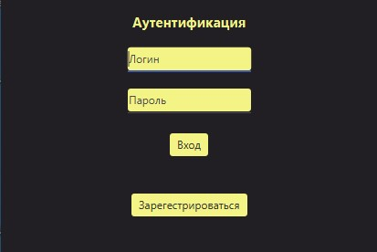

# Экспериментирую и учусь

В данном проекте используются:
  - JavaFX
  - jfoenix
  - SQLite
  - Hibernate
  - Maven
  
  
  
  
  
  
В intellij idea запуск приложения осуществляется с ключами
VM options: --module-path C:\javafx-sdk-13.0.1\lib --add-modules=javafx.controls --add-modules=javafx.fxml
Для этого предварительно нужно скачать javafx-sdk-13.0.1 либо указать путь до sdk, который скачал maven.
